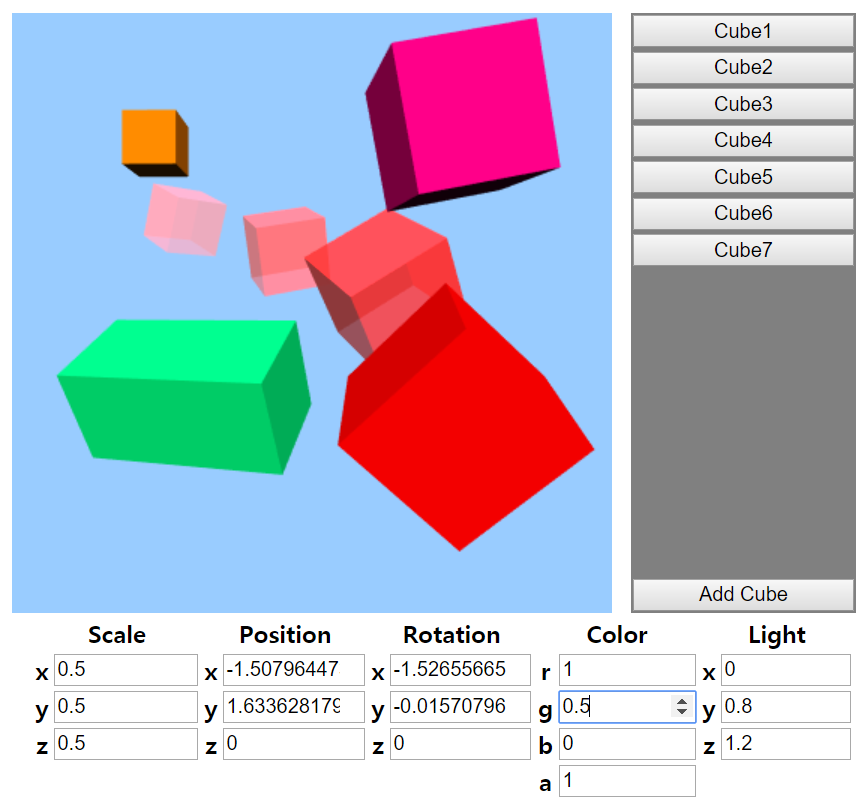
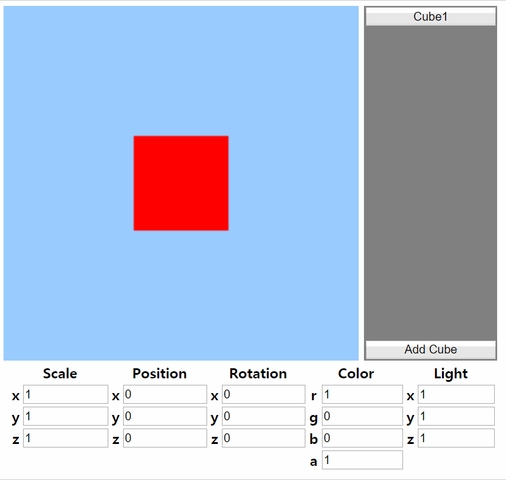
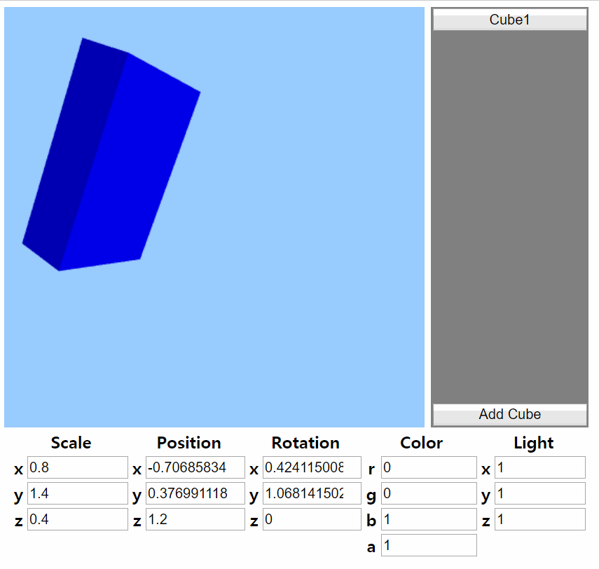
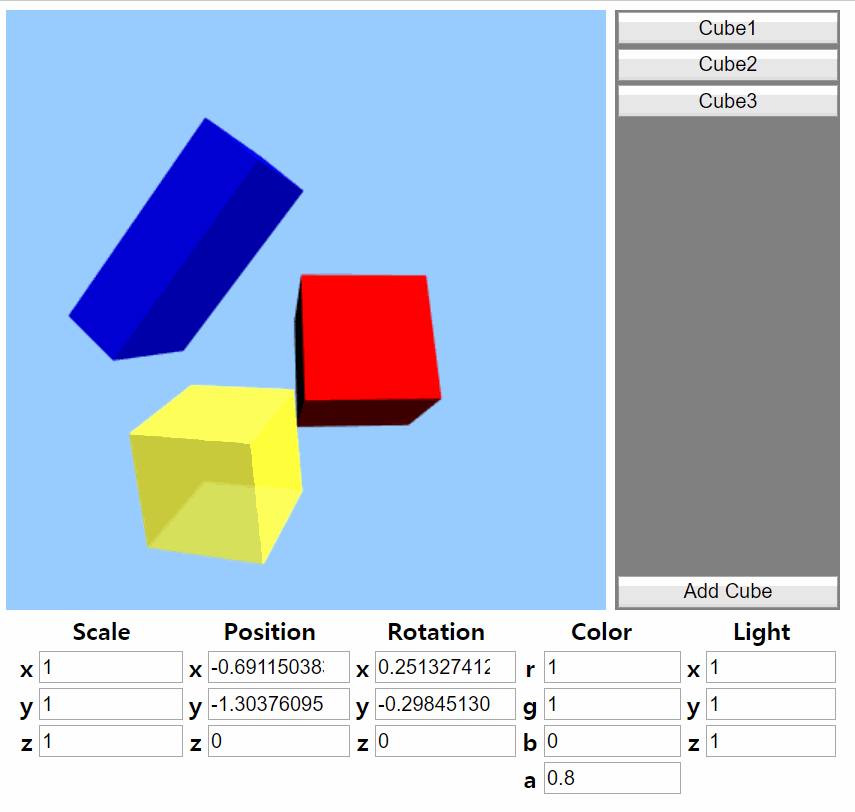
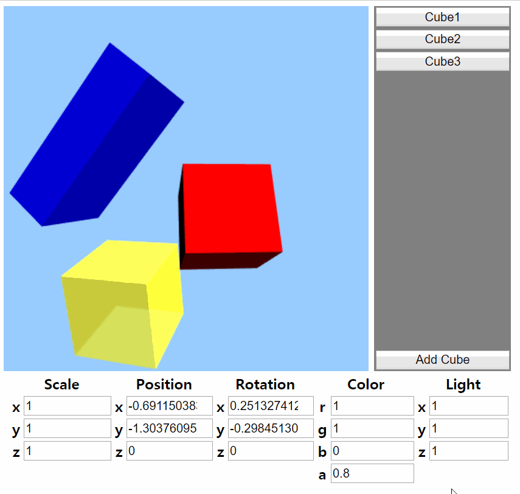

# My Little Cube
  
## 1. 개요
 큐브를 생성하고, 큐브별로 마우스를 통해 위치, 각도, 색상을 조절한다. 또한 빛의 방향을 조절하여 변화를 관찰할 수 있다. 큐브의 위치, 각도, 색상, 빛의 방향에 따라 큐브가 어떻게 보이는지 쉽게 확인하기 위해 제작하였다.
## 2. 기능
### 2.1. 큐브 회전
  
 큐브를 마우스를 드래그하여 회전시킨다. number input을 변경하여 회전할 수 있다.
### 2.2. 큐브 이동
  
 큐브를 Shift + 드래그로 이동시킨다. number input을 변경하여 이동할 수 있다.
### 2.3. 큐브 스케일 변경

### 2.4. 큐브 색상 변경
  
 r, g, b, a 키를 누른 후 마우스 휠을 스크롤하면 해당하는 색상의 값이 변경된다. number input으롤 변경할 수 있다.
### 2.5. 큐브 추가
  
 Add Cube 버튼을 눌러 새로운 큐브를 추가할 수 있다. 추가된 큐브 목록에서 원하는 큐브를 선택하여 조작할 수 있다.
### 2.6. 줌 인/줌 아웃
  
 마우스 휠을 스크롤하여 줌 인/줌 아웃할 수 있다.
### 2.7. 빛의 방향 변경
  
 number input을 변경하의 빛의 방향을 변경할 수 있다.
